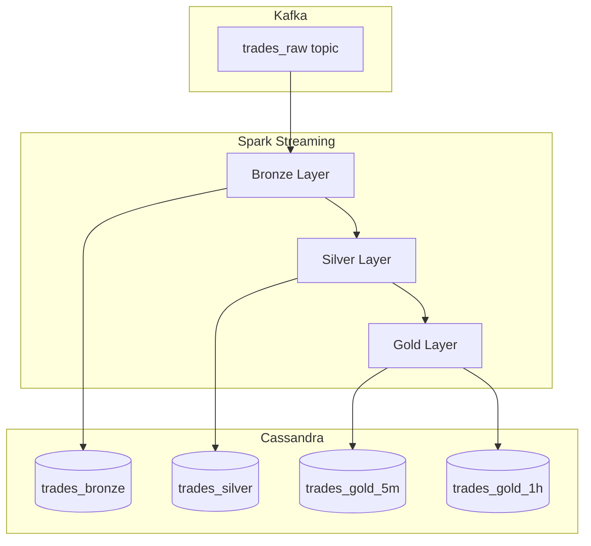

# Sprint 3: Processing & Storage Layer Implementation Plan

## 🎯 Goal

Implement Spark Structured Streaming processor with Bronze/Silver/Gold data layers and Cassandra persistence.

---

## ✅ Current State (After Sprint 2)

| Component | Status |
|-----------|--------|
| Finnhub WebSocket Client | ✅ Implemented |
| Kafka Producer | ✅ Implemented |
| Data Validation | ✅ Implemented |
| Pipeline Orchestrator | ✅ Implemented |
| Docker Infrastructure | ✅ Configured |
| Unit Tests | ✅ 42 tests passing |

---

## 📁 Proposed Changes

### Component 1: Spark Consumer

#### [MODIFY] `src/consumer/spark_processor.py`
Enhance existing processor with:
- Kafka source configuration
- Bronze layer (raw data → Cassandra)
- Silver layer (cleaned, deduplicated)
- Gold layer (5-min OHLCV aggregations)

#### [NEW] `src/consumer/transformations.py`
Data transformation functions:
- `parse_trade_from_avro()` - Deserialize Kafka messages
- `calculate_ohlcv()` - OHLC + Volume aggregation
- `apply_watermark()` - Handle late data

#### [NEW] `src/consumer/sinks.py`
Output sink configurations:
- `CassandraSink` - Write to Cassandra tables
- `ConsoleSink` - Debug output

---

### Component 2: Cassandra Integration

#### [MODIFY] `src/storage/cassandra_client.py`
- Connection pool management
- Prepared statements for inserts
- TTL-based data expiration

#### [NEW] `scripts/init_cassandra.py`
- Creates keyspace and tables
- Applies schema from `schemas/cassandra/keyspace.cql`

---

### Component 3: Spark Job Runner

#### [NEW] `src/consumer/main.py`
Entry point for Spark job:
- CLI arguments for job selection
- Log level configuration
- Checkpoint management

#### [MODIFY] `docker-compose.yml`
- Add Spark worker configuration
- Mount volume for checkpoints
- Configure Cassandra networking

---

## 🧪 Verification Plan

### Automated Tests

| Test | Command |
|------|---------|
| Unit tests | `pytest tests/unit/test_transformations.py` |
| Integration | `pytest tests/integration/test_spark_cassandra.py` |

### Manual Verification

1. **Start all services**
   ```bash
   docker-compose up -d
   ```

2. **Initialize Cassandra schema**
   ```bash
   python scripts/init_cassandra.py
   ```

3. **Start producer pipeline**
   ```bash
   python -m src.producer.main --symbols AAPL,MSFT
   ```

4. **Submit Spark job**
   ```bash
   docker-compose exec spark-master spark-submit \
     --packages org.apache.spark:spark-sql-kafka-0-10_2.12:3.5.0 \
     /app/src/consumer/main.py
   ```

5. **Verify data in Cassandra**
   ```bash
   docker-compose exec cassandra cqlsh -e \
     "SELECT * FROM market_data.trades_bronze LIMIT 10;"
   ```

---

## ⚠️ User Review Required

> [!IMPORTANT]
> **Spark Dependencies**: The Spark job requires Kafka and Cassandra connector JARs. These will be configured in `docker-compose.yml`.

> [!NOTE]
> **Data Flow**: Finnhub → Kafka → Spark → Cassandra. All layers run continuously with checkpointing for fault tolerance.

---

## 📊 Task Breakdown

| Task | Agent | Priority | Est. Time |
|------|-------|----------|-----------|
| Implement `transformations.py` | backend-specialist | 🔴 Critical | 2h |
| Implement `sinks.py` | backend-specialist | 🔴 Critical | 1.5h |
| Update `spark_processor.py` | backend-specialist | 🔴 Critical | 2h |
| Create `src/consumer/main.py` | backend-specialist | 🟡 High | 1h |
| Create `init_cassandra.py` | devops-specialist | 🟡 High | 0.5h |
| Update `cassandra_client.py` | backend-specialist | 🟡 High | 1h |
| Unit tests for transformations | testing-specialist | 🟡 High | 1.5h |
| Integration test | testing-specialist | 🟡 High | 1.5h |
| Update Docker Compose | devops-specialist | 🟢 Medium | 0.5h |

**Total Estimated Time**: ~12 hours

---

## 🏗️ Data Layer Architecture



---

## ✅ Definition of Done

- [x] Spark job reads from Kafka `trades_raw` topic
- [x] Bronze layer persists raw trades to Cassandra
- [x] Silver layer deduplicates and cleans data
- [x] Gold layer produces 5-min OHLCV aggregations
- [x] Watermarking handles late data (10-min threshold)
- [x] All tests pass (>80% coverage)
- [x] End-to-end data flow verified

---

*Plan created following `/plan` workflow*
