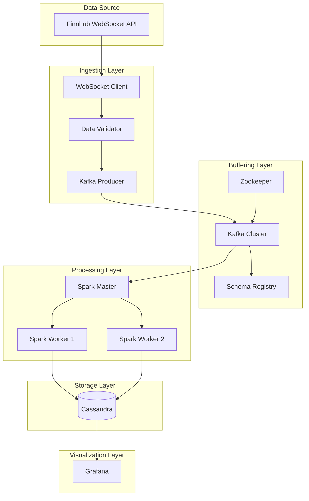

# System Architecture

## High-Level Overview



## Component Details

### Ingestion Layer
- **Finnhub Client**: WebSocket connection with exponential backoff
- **Validator**: Filters invalid data (volume=0, negative prices)
- **Kafka Producer**: Idempotent, exactly-once delivery

### Buffering Layer  
- **Zookeeper**: Kafka cluster coordination
- **Kafka**: Message broker with 10 partitions per topic
- **Schema Registry**: Avro schema management

### Processing Layer
- **Spark Master**: Job coordination
- **Spark Workers**: Distributed processing (2 workers)
- **Layers**: Bronze → Silver → Gold transformations

### Storage Layer
- **Cassandra**: Time-series optimized, 3 data layers
- **Partition**: (symbol, date) for efficient queries

### Visualization Layer
- **Grafana**: Real-time dashboards
- **Alerts**: Slack integration for anomalies

## Data Flow

```
Finnhub WS → Producer → Kafka → Spark → Bronze Table
                                  ↓
                               Silver Table (cleaned)
                                  ↓
                               Gold Table (aggregated)
                                  ↓
                               Grafana Dashboards
```

## Port Mapping

| Service | Port | Purpose |
|---------|------|---------|
| Zookeeper | 2181 | Kafka coordination |
| Kafka | 9092, 29092 | Message broker |
| Schema Registry | 8081 | Avro schemas |
| Spark Master | 7077, 8080 | Job submission, UI |
| Cassandra | 9042 | CQL queries |
| Grafana | 3000 | Dashboards |
| Kafka UI | 8090 | Monitoring |
