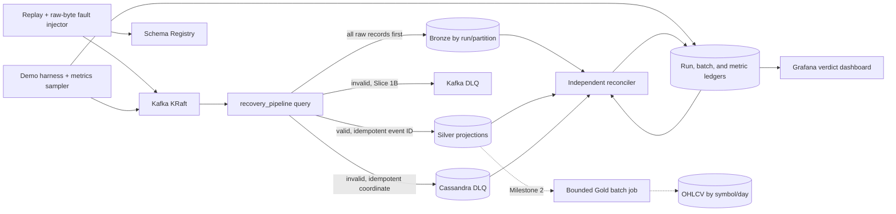

# Design: Market Stream Reliability Lab

Generated by /office-hours on 2026-09-07
Branch: main
Repo: duckonthemic/Real-Time-Financial-Market-Data-Pipeline
Status: APPROVED
Mode: Builder

## Problem Statement

Turn the repository into a credible fresher Data Engineer portfolio project that a reviewer can run and verify locally. The current Kafka, Spark, Cassandra, and Grafana skeleton is useful, but its documentation promises more than the code delivers:

- The producer sends JSON while the README claims Avro and Schema Registry integration.
- Kafka producer idempotence is presented as end-to-end exactly-once even though Cassandra writes and Kafka offsets are not one transaction.
- Kafka coordinates are discarded, transformation outputs do not consistently match Cassandra tables, and Gold is calculated from unvalidated input.
- Cassandra and Grafana rely on `ALLOW FILTERING`, unsupported grouping patterns, and unsuitable secondary indexes.
- `docker compose up` starts infrastructure but not an end-to-end pipeline.
- Packaging and dependency boundaries do not reproduce the committed test claims from a clean environment.

The finished project will make a narrower claim: Kafka-to-Spark processing is at least once, while deterministic keys make the portfolio scenario's Cassandra projections replay-safe. A failure-and-recovery test will prove that claim.

## What Makes This Cool

The “whoa” moment is a correctness proof rather than another moving stock chart:

1. Replay a fixed dataset through real Avro and Schema Registry.
2. Inject duplicate and invalid records.
3. Terminate Spark while the producer continues and lag rises.
4. Restart from persisted checkpoints.
5. Reconcile Kafka ranges, Bronze coordinates, DLQ reasons, and unique Silver identities.
6. End on a dashboard verdict: `PASS — recovery contract satisfied`.

The pre-review rough dashboard baseline is stored as gstack user data under `~/.gstack/projects/hoang/designs/market-data-reliability-dashboard-20260907/`. It is not an approved final mockup: the evidence-first hierarchy, state matrix, responsive ownership, and accessibility contract in this document supersede its stale labels/layout. A final implementation screenshot is approved only after `/design-consultation` creates `DESIGN.md` and visual QA passes.

## Constraints

- Target role: fresher Data Engineer. Optimize for explainable fundamentals and evidence.
- Keep Python, Kafka, Schema Registry, Spark Structured Streaming, Cassandra, Grafana, Docker Compose, and GitHub Actions.
- A laptop with Docker Desktop and Python 3.11 is the supported environment.
- The acceptance demo uses deterministic replay and no paid API.
- Target time from healthy local images to a result: at most 15 minutes.
- Do not add Airflow, dbt, Kubernetes, cloud services, or ML to inflate the stack.
- Do not claim production readiness or end-to-end exactly-once delivery.
- Single-node infrastructure is a portfolio environment, not a production topology.

## Scope and Milestones

### Milestone 1 — Recovery MVP

Milestone 1 is intentionally delivered as two mergeable slices. Both slices are required before the repository is presented in a CV.

#### Slice 1A — Core correctness proof

- Deterministic replay, actual Avro serialization, Schema Registry compatibility, and Kafka KRaft.
- Bronze storage with Kafka coordinates and raw bytes.
- Silver-by-run validation, deterministic identity, and replay-safe Cassandra projection.
- Cassandra DLQ keyed by original source coordinates.
- One named Spark query, `recovery_pipeline`, with one per-run checkpoint and offset frontier.
- One injected Spark restart, local run-scoped reconciliation, and standalone HTML/JSON reports.
- Reproducible packaging plus unit, contract, and local integration tests.
- Only four Cassandra tables: Bronze, Silver-by-run, Cassandra DLQ, and the per-query batch ledger. Run state, checks, and lag samples remain in `artifacts/<run_id>/` for this slice.

Slice 1A must reach a real `PASS` before Slice 1B begins.

#### Slice 1B — Portfolio presentation

- Add the keyed Kafka DLQ with acknowledged delivery and distinct-key reconciliation.
- Add query-optimized Silver, run, transition, check, and metric tables.
- Provision the minimal Grafana verdict dashboard from those tables.
- Add the reduced CI recovery job and the separate Grafana provisioning smoke job.

### Milestone 2 — Analytics polish

Implemented only after Milestone 1 is green:

- A bounded Spark batch job reads the completed Silver run and produces deterministic 5-minute OHLCV/VWAP Gold rows.
- The full dashboard adds OHLCV, p95 processing latency, data-quality breakdowns, and the richer recovery timeline shown in the wireframe.
- A maximum-window-volume test protects the deterministic open/close calculation.

Gold is deliberately batch-finalized for a completed replay. Continuous event-time Gold, watermark eviction, and late-event correction are separate streaming-design problems and are not claimed by this version.

### Deferred Extensions

- Live Finnhub ingestion, including secret handling, reconnect/backoff, market-hours behavior, rate-limit handling, and its weaker provider identity semantics. The prototype client is removed from the Recovery MVP rather than retained as unverified dead code; reintroduction starts from the tested source-adapter boundary.
- Continuous Gold windows and late-data correction.
- Published images in GitHub Container Registry are a post-MVP P2 TODO. Cloud deployment is explicitly not on the roadmap; local evidence, CI artifacts, and the showcase video are sufficient.

## Premises

- After prerequisites, the reviewer runs one command: `python scripts/demo.py --scenario recovery`.
- A new run receives a new ULID `run_id`. A caller-supplied ID that is already terminal is rejected; concurrent standard demos are unsupported.
- Kafka uses KRaft; ZooKeeper is removed.
- Schema Registry is used by normal records. A separate fault injector sends malformed bytes intentionally.
- The query owns every captured coordinate through its configured run; received attribution headers are preserved but may be missing, malformed, or spoofed and are validated as untrusted input.
- Bronze preserves bytes and Kafka coordinates; Silver validates and collapses duplicate semantic identities through deterministic Cassandra keys; Gold later reads the completed Silver projection.
- Cassandra tables are designed from exact queries. Runtime code and dashboards contain no `ALLOW FILTERING`.
- Deterministic primary keys and stable values make sink retries idempotent. The batch ledger is evidence, not a distributed transaction.

## Approaches Considered

### Approach A: Minimal portfolio cleanup

Repair packaging, schemas, README, and a simple replay. Rejected because it improves hygiene without creating a distinctive, testable interview demonstration.

### Approach B: Contract-first Reliability Lab

Use explicit contracts, deterministic fault injection, replay-safe storage keys, checkpoint recovery, and independent reconciliation. Chosen because every major technology supports one coherent story about data correctness.

## Recommended Approach

### Architecture



### Authoritative standard-run configuration

`config/demo.toml` is the single source of truth. The launcher reads it with Python 3.11 `tomllib`, so one-command preflight does not depend on PyYAML or an editable install. Tests load it rather than duplicating constants.

After validation, `scripts/demo.py` renders the exact Compose substitutions for that run to `artifacts/<run_id>/compose.env` and passes it explicitly with `docker compose --env-file <absolute-path>`. Generated keys cover image/build versions, resource limits, ports, run identity, schema ID, topic names, artifact path, and checkpoint path. Compose files contain required `${VARIABLE:?message}` references rather than fallback copies. The run report records a redacted SHA-256 of this generated environment and the resolved `docker compose config`; repository tests fail if a required TOML field has no mapping or if runtime constants duplicate authoritative values.

Kafka, Schema Registry, Cassandra, and Spark master expose no host ports in the standard profile; project-owned tools reach them over the private Compose network. Grafana and the optional Spark UI bind only to configurable `127.0.0.1` ports. `demo.py` generates a per-run Grafana admin password with `secrets`, writes it only to the ignored `compose.env` with user-only file permissions where supported, and prints the local dashboard URL plus username. Reports and resolved-config evidence redact secret values. Kafka UI is removed from the standard profile and may exist only behind an explicit debug profile bound to loopback.

| Setting | Standard value |
|---|---|
| Configuration | `config/demo.toml`, parsed by Python 3.11 `tomllib` before project dependencies are installed |
| Dataset manifest | `fixtures/standard/manifest.json` |
| Input topic | `market.trades.v1`, 3 partitions, replication 1, delete retention 24 hours |
| DLQ topic | `market.trades.dlq.v1`, 3 partitions, replication 1, compact+delete retention 7 days |
| Producer rate | 50 records/second |
| Spark trigger | 5 seconds with `maxOffsetsPerTrigger=1000` |
| Standard records | 12,480 valid base + 246 duplicates + 37 invalid = 12,763 total |
| Kill gate | `recovery_pipeline` covers at least 3,000 run records; producer has published 3,500-7,500 and is still active |
| Failure dwell | 15 seconds; `recovery_pipeline` lag must rise by at least 500 records |
| Infra timeout | 8 minutes |
| Scenario timeout | 15 minutes after infrastructure is healthy |
| Local resources | 4 CPU, 8 GiB RAM allocated to Docker, 10 GiB free disk |
| Kafka / Registry | `confluentinc/cp-kafka:7.7.2`, `confluentinc/cp-schema-registry:7.7.2` |
| Spark / connector | `apache/spark:3.5.5` custom app image, Scala 2.12, `spark-cassandra-connector_2.12:3.5.1` |
| Cassandra | `cassandra:4.1.7`, local replication factor 1 |
| Grafana / plugin | `grafana/grafana:11.4.0`, `hadesarchitect-cassandra-datasource 3.3.0` |
| Numeric comparison | Price/VWAP absolute tolerance `1e-6`; integer volumes and counts exact |

The container limits are part of the same config and must total no more than the advertised allocation:

| Service | CPU limit | Memory limit | Heap/runtime cap |
|---|---:|---:|---|
| Kafka | 0.50 | 1.0 GiB | JVM `-Xms512m -Xmx512m` |
| Schema Registry | 0.25 | 0.5 GiB | JVM 256 MiB |
| Cassandra | 1.00 | 2.0 GiB | JVM `-Xms512m -Xmx1024m` |
| Spark master | 0.25 | 0.5 GiB | JVM 256 MiB |
| Spark worker | 1.00 | 1.5 GiB | worker memory 1 GiB |
| Spark application | 0.75 | 1.0 GiB | driver memory 768 MiB |
| Grafana | 0.25 | 0.5 GiB | process/container cap |

Total limits are 4 CPU and 7 GiB, leaving 1 GiB of an 8 GiB Docker allocation for network, filesystem, and engine overhead. Compose uses enforceable `cpus` and `mem_limit` values. A clean release smoke run with exactly an 8 GiB Docker allocation is required; if it fails, the documented minimum must be raised rather than hidden.

The Grafana Cassandra plugin pin must be installed during image build, not downloaded at container startup. Its provisioning smoke test verifies datasource health, variable interpolation, and the exact CQL used by the dashboard. If that smoke test fails, `data_contract_status` may still pass and the verifier still emits `artifacts/<run_id>/report.html`, but `portfolio_release_status` fails. The demo command exits according to `data_contract_status`; the repository is not ready for CV publication until both statuses pass.

`docker/spark/Dockerfile` builds the `spark-recovery` image from the pinned Spark base. A build-only dependency resolver fetches the complete, version-pinned Kafka source, Spark Avro, and Cassandra connector JAR closure; `docker/spark/jars.lock.json` records each artifact coordinate and SHA-256 digest. The final stage contains only the application and verified JARs under `/opt/spark/jars`. Runtime configuration must not use `spark.jars.packages`, `--packages`, Ivy, Coursier, or Maven network resolution. CI rebuilds the image from an empty dependency cache and fails on a missing or changed digest. After images exist, a reduced integration profile runs on an egress-blocked Compose network and must complete while loading the real Kafka, Avro, and Cassandra providers; the test also rejects resolved Spark configuration containing runtime package resolvers or Maven URLs.

### Event, header, and identity contract

Normal values use `schemas/trade_event_v1.avsc` with these fields:

| Field | Avro type | Rule |
|---|---|---|
| `event_id` | string | Stable semantic identity; lowercase 64-character SHA-256 hex |
| `run_id` | string | Must equal the `run_id` Kafka header |
| `source` | enum | `REPLAY` in the acceptance scenario |
| `symbol` | string | Uppercase and non-empty after trimming |
| `price` | double | Finite and greater than zero |
| `volume` | long | Greater than zero |
| `event_time_ms` | long | UTC epoch milliseconds in the manifest's allowed range |
| `conditions` | array of string | Empty array allowed |
| `dataset_id` | string | Must equal the dataset header |
| `source_sequence` | long | Stable canonical input line number |
| `schema_version` | int | `1` |

Every input record, including malformed values, carries UTF-8 Kafka headers:

- `run_id`
- `dataset_id`
- `source_sequence`
- `payload_type`, either `avro-confluent-v1` or `malformed-test-v1`
- `produced_at_ms`, used only for operational latency

Storage ownership never trusts the record. The query's immutable configured `run_id` is written as `owner_run_id` and forms the Bronze/DLQ partition key for every Kafka coordinate in the captured run range. The received `run_id` header is preserved separately as nullable `claimed_run_id`; the received dataset/source headers are likewise preserved even when invalid. A missing or malformed required header receives `MISSING_OR_INVALID_HEADER`. For a decodable record, a claimed run/dataset that differs from the configured run or payload receives `HEADER_PAYLOAD_MISMATCH`. This distinction lets malformed or spoofed attribution be quarantined without losing run isolation.

For replay events, identity is:

```text
sha256(UTF8(dataset_id) || 0x00 || UTF8(base10(source_sequence)))
```

The output is lowercase hexadecimal. Duplicate injection republishes a selected canonical event with the same `run_id`, `dataset_id`, `source_sequence`, payload, and `event_id`, but records a fresh operational `produced_at_ms`. Golden vectors in `tests/contracts/test_event_identity.py` lock byte-level behavior.

The normal producer uses Confluent's Avro serializer and subject `market.trades.v1-value`. Provisioning sets that subject to `BACKWARD_TRANSITIVE`. Historical reader baselines are committed as `schemas/history/trade_event/v*.avsc`; CI starts an ephemeral Registry, registers all historical versions in order, and rejects a proposed schema unless Registry accepts it against the full subject history. The raw-byte fault injector bypasses the serializer only for the five `BAD_WIRE` fixture cases and still attaches valid attribution headers.

Slice 1A intentionally supports one provisioned value-schema ID per run. Provisioning records the Registry-returned ID in `artifacts/<run_id>/run.json` and passes it to Spark with the checked-in `trade_event_v1.avsc` reader schema. For every record, `recovery_pipeline` first preserves the untouched bytes in Bronze, then requires a five-byte Confluent envelope: magic byte `0`, a four-byte big-endian schema ID equal to the run's provisioned ID, and a non-empty Avro payload. Spark strips the envelope and applies built-in `from_avro`; truncated envelopes, unknown IDs, or decode failures receive `BAD_WIRE`. This avoids per-record Registry calls and Python UDF decoding. Multi-schema-ID consumption is deferred until a real schema migration requires it.

Validation uses one deterministic first-match precedence:

1. `MISSING_OR_INVALID_HEADER`
2. `BAD_WIRE`
3. `HEADER_PAYLOAD_MISMATCH`
4. `EMPTY_SYMBOL`
5. `NON_POSITIVE_PRICE`
6. `NON_POSITIVE_VOLUME`
7. `TIMESTAMP_OUT_OF_RANGE`

Tests include a record violating multiple business rules and assert that the first matching code wins. Header and malformed-wire test cases are generated outside the 12,480 canonical valid events.

### Deterministic fixture and validation outcomes

`fixtures/standard/manifest.json` records the generator version, seed, symbols, allowed event-time range, partition expectation, canonical event hashes, and expected counts.

| Outcome | Expected count |
|---|---:|
| Canonical valid events | 12,480 |
| Injected duplicate inputs | 246 |
| `BAD_WIRE` | 5 |
| `HEADER_PAYLOAD_MISMATCH` | 4 |
| `EMPTY_SYMBOL` | 8 |
| `NON_POSITIVE_PRICE` | 8 |
| `NON_POSITIVE_VOLUME` | 8 |
| `TIMESTAMP_OUT_OF_RANGE` | 4 |
| Total invalid | 37 |
| Total input-topic records | 12,763 |

The fixture includes out-of-order valid records, but Milestone 1 applies no watermark and makes no late-event claim. Slice 1A relies on deterministic Cassandra upsert keys rather than Spark stateful deduplication. Milestone 2 Gold sorts the completed Silver rows, so terminal-window and watermark-advance protocols are unnecessary.

### Run boundaries and lifecycle

The demo harness obtains an exclusive `.gstack/demo.lock` before creating a run. A stale lock is reported with recovery instructions; it is not silently deleted. Parallel standard runs are unsupported.

Before the first publish, the harness captures each input partition's Kafka end offset as `start_offset_inclusive`; this is the offset the next record will receive. After producer flush succeeds, it captures the new Kafka end offset as `end_offset_exclusive`. The run's physical range is `[start_offset_inclusive, end_offset_exclusive)` per partition. Its expected physical count is `sum(end_offset_exclusive - start_offset_inclusive)`. All Bronze coverage and lag calculations are clamped to those half-open ranges, so earlier or later retained records are excluded.

A completed or failed `run_id` cannot be reused. Repeating the scenario creates a new run with the same manifest expectations, not the same physical Kafka offsets.

Run states and owners:

| State | Owner | Exit condition |
|---|---|---|
| `CREATED` | Harness | Run identity and immutable configuration stored in `artifacts/<run_id>/run.json` |
| `INFRA_READY` | Harness | Required health checks and provisioning pass; local run metadata is mirrored to `pipeline_runs` when Slice 1B is enabled |
| `RUN_READY` | Harness | Starting offsets captured and the per-run query initialized at those offsets |
| `PRODUCING` | Producer | First delivery acknowledged |
| `FAILURE_INJECTED` | Harness | The query offset gate passes and the Spark app is stopped |
| `RECOVERING` | Harness | Spark app restarted with the same checkpoints |
| `VERIFYING` | Harness | Producer flushed and the query's next offsets equal all captured `end_offset_exclusive` values |
| `PASSED` | Reconciler | Every correctness invariant passes |
| `FAILED` | Harness/reconciler | A component or invariant fails |
| `TIMED_OUT` | Harness | A configured deadline expires |

Terminal states are `PASSED`, `FAILED`, and `TIMED_OUT`. In Slice 1A, each transition appends an atomic run-scoped JSONL record with sequence, UTC timestamp, actor, and bounded reason; no transition leaves a terminal state. Slice 1B mirrors those records to `run_state_transitions_by_run`. The reconciler writes named checks to the run report in Slice 1A and mirrors one `run_checks_by_run` row per invariant in Slice 1B so the same expected-versus-actual facts drive Grafana.

### Spark query map

Slice 1A uses one query so the recovery proof has one checkpoint and one next-offset frontier. `foreachBatch` persists the unfiltered micro-batch once, writes each replay-safe projection, then unpersists it in `finally`.

Implement the callback as one explicit `process_recovery_batch(raw_batch, batch_id, dependencies)` function. Small pure DataFrame helpers derive batch bounds, Bronze rows, decoded rows, validation outcomes, Silver rows, and DLQ rows. Concrete ledger, Bronze, Silver, and DLQ writers are passed in through a small immutable dependency bundle so tests can fail any boundary deterministically. Do not retain the prototype multi-query `SinkManager` or replace it with a generic plugin/factory framework.

| Query | Transformation and sinks | Checkpoint | Trigger/output |
|---|---|---|---|
| `recovery_pipeline` | Preserve and upsert every raw input to Bronze; decode and validate; upsert Silver by deterministic `event_id`; upsert Cassandra DLQ by source coordinate; add acknowledged Kafka DLQ and query-optimized Silver in Slice 1B; update one ledger row | `/checkpoints/<run_id>/recovery_pipeline` | 5 seconds / append, at most 1,000 source records per batch |
| `gold_ohlcv_batch` | Milestone 2 only: read completed `silver_events_by_run`, deterministically aggregate, upsert Gold | `/checkpoints/gold/<run_id>` | bounded batch |

The query starts from the captured `start_offset_inclusive` map for its run. Only failure recovery reuses that run's checkpoint path. A new run receives a new path, so state cannot leak across runs. `python scripts/demo.py --cleanup-run <run_id>` removes only that run's Compose runtime resources and explicitly named checkpoint volume while retaining evidence. `python scripts/demo.py --purge-evidence <run_id>` is the separate explicit operation that removes the retained artifact directory after runtime cleanup.

Both cleanup paths load the run manifest, recompute the expected Compose project and volume names, resolve the artifact path beneath the configured artifact root, reject links or traversal outside that root, and refuse a run whose orchestrator lock is active. Unknown resources are reported without widening the target. Unit tests use a temporary root plus a fake command runner for every refusal branch; an integration test creates two reduced-run resource sets, cleans one, and proves the other's containers, volume, checkpoint, and report remain intact.

For Milestone 1, the query does not keep Spark deduplication state. Duplicate valid inputs upsert the same `(run_id, event_id)` Cassandra key, which is the behavior the recovery proof measures. Continuous ingestion and watermark-bounded in-engine deduplication are deferred. Tests prove duplicates before and after the injected restart remain one Silver identity.

For each streaming query batch:

1. Before validation or deduplication, calculate each partition's batch bounds as `min(offset)` and `max(offset) + 1` directly from the unfiltered micro-batch DataFrame. Cumulative progress is the next unprocessed offset per partition.
2. If `(run_id, query_name, batch_id)` is already `COMPLETED`, skip data writes.
3. Otherwise upsert the ledger row as `STARTED`, increment `attempt_count`, and store batch bounds.
4. Upsert deterministic Cassandra rows.
5. For invalid rows, upsert Cassandra DLQ rows keyed by source coordinate. In Slice 1B, also publish Kafka DLQ messages keyed by `source_topic:source_partition:source_offset`.
6. In Slice 1B, wait for every asynchronous Kafka DLQ delivery callback, perform a bounded flush, and fail the micro-batch if any delivery fails or the flush times out. Cassandra rows already written remain safe to upsert again; replay may create accepted duplicate physical DLQ messages.
7. Calculate batch p95 as `batch_completed_at - produced_at_ms` over all input records with a valid production header, including valid, invalid, and duplicate inputs.
8. After every enabled sink and the Slice 1B DLQ acknowledgement barrier succeed, update the ledger row to `COMPLETED` with counts, cumulative next offsets, completion time, and p95.
9. For a caught exception, update it to `FAILED` with bounded `last_error` before the application fails. An existing `STARTED` or `FAILED` row is replayed; only `COMPLETED` skips writes.

`process_recovery_batch` owns one persisted raw-batch reference and always unpersists it in `finally`. Unit tests assert writer order, `COMPLETED` short-circuiting, retry after `STARTED`/`FAILED`, ledger failure behavior, and unpersist on success plus every injected writer exception. Spark integration tests cover real connector mappings; unit tests do not mock Spark expression semantics.

Unit and contract tests cover the valid envelope, wrong magic byte, truncated header, unknown schema ID, empty payload, and corrupt Avro payload. A container integration test registers the checked-in schema, asserts that the captured ID is propagated to Spark, and verifies that valid and `BAD_WIRE` fixture counts match the manifest.

A crash after a data write but before the ledger update replays the upserts safely. Kafka DLQ publishing remains at least once across a process restart, so duplicate physical DLQ messages are acceptable. The Kafka DLQ is compacted by its original-coordinate key; reconciliation counts distinct keys and uses Cassandra DLQ as the immediate queryable projection. Cassandra DLQ `source_timestamp` is copied from the original Kafka record and is stable across sink retries; operational attempt time lives only in the batch ledger.

### Producer delivery and deterministic failure

- Normal records use the Avro serializer; only the explicit fault injector writes raw malformed bytes.
- Partition by `symbol`; malformed cases carry a deterministic partitioning key in the manifest.
- Enable producer idempotence and acknowledgements, but count a record only in its successful delivery callback.
- Use bounded iterative retry with backoff for buffer pressure; no recursive retry.
- Flush before `end_offset_exclusive` values are captured and fail if delivery errors remain.
- Expose fixture, seed, rate, and generated run ID. A completed user-supplied run ID is rejected.

At 50 records/second, the harness waits until `recovery_pipeline` has covered at least 3,000 records while the producer is between 3,500 and 7,500 delivered records. It stops the Spark application for 15 seconds while the producer continues. The run fails immediately if the producer has already completed, if fewer than 500 records remain to publish, or if run-scoped lag does not increase by at least 500 before restart.

The application runs as a dedicated Compose service named `spark-recovery`. It launches `spark-submit` in client mode, so the service owns the driver process while `spark-master` and the single worker remain independent. Failure injection uses `docker compose kill -s SIGKILL spark-recovery`, confirms the container exited nonzero, observes the configured lag increase, and recreates that same service with the original run configuration. Its checkpoint path is a named volume mounted at `/checkpoints/<run_id>/recovery_pipeline`; killing or recreating only the driver container must not remove it. The producer and all infrastructure services remain running. Tests reject `restart: always` or another policy that would race the deliberate kill.

The harness records the pre-kill and post-restart container IDs, kill timestamp, exit code, checkpoint path, and lag samples in the run report. A Compose contract test asserts that `spark-recovery` has `restart: "no"` and that the checkpoint volume is external to the container writable layer. The scenario fails if the driver exits cleanly, automatically restarts before the harness command, or resumes with a different checkpoint directory.

Query lag at sample time is defined per partition as:

```text
max(0, min(current_kafka_end_offset, run_end_offset_exclusive_if_known)
       - max(query_next_offset, run_start_offset_inclusive))
```

Total lag is the sum across the three partitions. It is derived from Kafka end offsets and the query's latest Spark progress/ledger offsets, not from Kafka consumer-group commits.

### Cassandra schema

Authoritative DDL lives in `schemas/cassandra/001_keyspace.cql` and `002_tables.cql`. All timestamps are UTC Cassandra `timestamp`; prices and VWAP use `double`; volumes and counts use `bigint`. Demo tables have no TTL because users need stable evidence until explicit cleanup.

Provisioning is slice-aware even though the final DDL is shown together below. Slice 1A creates only `bronze_records_by_run_partition`, `silver_events_by_run`, `dlq_records_by_run`, and `stream_batches_by_query`. Slice 1B adds `pipeline_runs`, `silver_events_by_symbol_day`, `run_state_transitions_by_run`, `run_checks_by_run`, and `run_metrics_by_run`. Milestone 2 alone adds `gold_ohlcv_5m_by_symbol_day`.

```sql
CREATE KEYSPACE IF NOT EXISTS market_data
WITH replication = {'class': 'SimpleStrategy', 'replication_factor': 1};

CREATE TABLE IF NOT EXISTS market_data.pipeline_runs (
  run_id text PRIMARY KEY,
  dataset_id text,
  state text,
  expected_counts map<text, bigint>,
  start_offsets_inclusive map<int, bigint>,
  end_offsets_exclusive map<int, bigint>,
  data_contract_status text,
  portfolio_release_status text,
  created_at timestamp,
  started_at timestamp,
  failure_at timestamp,
  recovered_at timestamp,
  completed_at timestamp,
  state_reason text
);

CREATE TABLE IF NOT EXISTS market_data.bronze_records_by_run_partition (
  owner_run_id text, source_topic text, source_partition int, source_offset bigint,
  kafka_timestamp timestamp, kafka_key blob, raw_value blob, schema_id int,
  claimed_run_id text, claimed_dataset_id text, claimed_source_sequence bigint,
  claimed_payload_type text, claimed_produced_at_ms bigint,
  PRIMARY KEY ((owner_run_id, source_topic, source_partition), source_offset)
) WITH CLUSTERING ORDER BY (source_offset ASC);

CREATE TABLE IF NOT EXISTS market_data.silver_events_by_run (
  run_id text, event_id text, symbol text, event_time timestamp, event_date date,
  price double, volume bigint, conditions list<text>, source_sequence bigint,
  PRIMARY KEY ((run_id), event_id)
);

CREATE TABLE IF NOT EXISTS market_data.silver_events_by_symbol_day (
  run_id text, symbol text, event_date date, event_time timestamp, event_id text,
  price double, volume bigint, conditions list<text>,
  PRIMARY KEY ((run_id, symbol, event_date), event_time, event_id)
) WITH CLUSTERING ORDER BY (event_time ASC, event_id ASC);

CREATE TABLE IF NOT EXISTS market_data.dlq_records_by_run (
  owner_run_id text, source_topic text, source_partition int, source_offset bigint,
  claimed_run_id text, rejection_code text, rejection_detail text,
  raw_value blob, source_timestamp timestamp,
  PRIMARY KEY ((owner_run_id), source_topic, source_partition, source_offset)
);

CREATE TABLE IF NOT EXISTS market_data.stream_batches_by_query (
  run_id text, query_name text, batch_id bigint, status text,
  input_count bigint, valid_count bigint, invalid_count bigint,
  batch_start_offsets map<int, bigint>, batch_end_offsets_exclusive map<int, bigint>,
  cumulative_next_offsets map<int, bigint>, attempt_count int,
  processing_latency_p95_ms bigint, last_error text,
  started_at timestamp, completed_at timestamp,
  PRIMARY KEY ((run_id, query_name), batch_id)
) WITH CLUSTERING ORDER BY (batch_id ASC);

CREATE TABLE IF NOT EXISTS market_data.run_state_transitions_by_run (
  run_id text, transition_seq int, state text, actor text,
  occurred_at timestamp, reason text,
  PRIMARY KEY ((run_id), transition_seq)
) WITH CLUSTERING ORDER BY (transition_seq ASC);

CREATE TABLE IF NOT EXISTS market_data.run_checks_by_run (
  run_id text, check_name text, expected_value text, actual_value text,
  status text, detail text, checked_at timestamp,
  PRIMARY KEY ((run_id), check_name)
);

CREATE TABLE IF NOT EXISTS market_data.run_metrics_by_run (
  run_id text, sampled_at timestamp, query_name text,
  total_lag bigint, partition_lag map<int, bigint>, processed_count bigint,
  processing_latency_p95_ms bigint,
  PRIMARY KEY ((run_id), sampled_at, query_name)
) WITH CLUSTERING ORDER BY (sampled_at ASC, query_name ASC);

CREATE TABLE IF NOT EXISTS market_data.gold_ohlcv_5m_by_symbol_day (
  run_id text, symbol text, window_date date, window_start timestamp,
  window_end timestamp, open double, high double, low double, close double,
  volume bigint, trade_count bigint, vwap double,
  PRIMARY KEY ((run_id, symbol, window_date), window_start)
) WITH CLUSTERING ORDER BY (window_start ASC);
```

Milestone 2 open/close ordering uses `(event_time, event_id)`. For the portfolio-scale bound of at most 25,000 events and at most 2,000 events per symbol/window, a sorted bounded collection is acceptable; a stress test rejects larger fixtures until a constant-memory ordered aggregation replaces it.

### Access-path matrix

| Consumer | Query shape |
|---|---|
| Reconciler Bronze coverage | For each of 3 partitions: `WHERE owner_run_id=? AND source_topic=? AND source_partition=? AND source_offset>=? AND source_offset<?` using `[start,end)` |
| Reconciler unique Silver | `WHERE run_id=?` on `silver_events_by_run`; count client-side while streaming rows |
| Reconciler DLQ | `WHERE owner_run_id=?` on `dlq_records_by_run`; group reason codes client-side |
| Harness query progress | `WHERE run_id=? AND query_name=? ORDER BY batch_id DESC LIMIT 1` on `stream_batches_by_query` |
| Dashboard run state | `WHERE run_id=?` on `pipeline_runs` |
| Dashboard state timeline | `WHERE run_id=?` on `run_state_transitions_by_run` |
| Dashboard invariant table | `WHERE run_id=?` on `run_checks_by_run` |
| Dashboard lag/timeline | `WHERE run_id=? AND sampled_at>=? AND sampled_at<=?` on `run_metrics_by_run` |
| Dashboard Silver sample | `WHERE run_id=? AND symbol=? AND event_date=? AND event_time>=? AND event_time<=?` |
| Dashboard Gold | Same full partition key and window range on `gold_ohlcv_5m_by_symbol_day` |

The demo URL includes `?var-run_id=<run_id>` so the dashboard never needs a cross-partition “latest run” query. Repository tests reject `ALLOW FILTERING` and secondary-index DDL in runtime assets.

### Metrics and latency

The host demo harness samples every 2 seconds. It reads Kafka partition end offsets and the latest query ledger offsets, computes the run-clamped lag above, and appends the run-scoped metrics JSONL. Slice 1B's containerized metrics publisher mirrors those samples into `run_metrics_by_run` for Grafana.

`produced_at_ms` in a Kafka header is the latency start. The Cassandra batch completion time is the operational end. `recovery_pipeline` calculates p95 over all batch inputs with a valid production header, stores it in `stream_batches_by_query`, and the sampler copies the latest completed-batch value into `run_metrics_by_run`. Milestone 2 displays this informational metric; it is not part of data-correctness equality. Samples are retained until explicit demo cleanup.

### Independent reconciliation contract

The verifier reads `fixtures/standard/manifest.json`, captured run offset ranges, and persisted outputs. It does not reuse the pipeline's aggregate code.

Test the verifier as an adversary, not only on a healthy fixture. `tests/unit/verification/test_invariants.py` starts from one known-good repository snapshot and independently mutates: a missing and extra Bronze coordinate, a duplicate/missing/extra Silver identity, a missing/extra DLQ coordinate, an incorrect rejection-code count, an unfinished source offset frontier, nonzero terminal lag, and a lingering `STARTED`/`FAILED` batch. Each mutation must fail only the expected named invariant while the baseline passes. A container integration test completes a reduced run, alters one Cassandra projection through a test-only command, reruns verification, and asserts a nonzero exit plus the corresponding failed check; it then removes the test mutation.

Value equality is deliberately sampled rather than exhaustive. The fixture manifest commits a deterministic sample selected by the lowest 256 hashes of canonical `event_id`, plus first/last coordinates from every partition and all 37 invalid coordinates. The verifier compares sampled Silver business fields with manifest values and reads the corresponding Kafka input records to compare key/raw-value/header digests with Bronze. Mutation tests alter one selected Silver value and one selected Bronze raw value while preserving their keys; both must fail. Reports label this check `sampled_value_integrity`, show sample size and coverage percentage, and never claim full payload equality.

Milestone 1 passes only when:

- Producer callbacks acknowledge exactly 12,763 input-topic records in the captured ranges.
- Bronze contains every source coordinate in those ranges exactly once: 12,763 rows.
- Cassandra DLQ contains exactly 37 unique source coordinates with the manifest reason counts.
- Reading Kafka DLQ yields the same 37 distinct coordinate keys; extra physical messages are reported but do not fail idempotent-storage correctness.
- Silver canonical storage contains exactly 12,480 event IDs matching the manifest set.
- The deterministic sampled-value check matches all selected Silver fields and Bronze source-record digests; this is explicitly reported as sampled rather than exhaustive integrity.
- All 246 duplicate inputs are observed and no logical duplicate is stored.
- The query's cumulative next offsets equal every `end_offset_exclusive` after restart.
- Lag rose by at least 500 during failure and returned to zero.
- No batch ledger row remains failed or incomplete when verification begins.

Milestone 2 adds exact Gold window count and OHLCV/VWAP comparisons with the configured tolerance.

The verifier writes `artifacts/<run_id>/run-report.json`, `report.html`, and a terminal `PASS`/`FAIL`. Slice 1B stores the same component verdicts in `pipeline_runs` for Grafana.

### Dashboard contract

Milestone 1 Grafana uses an evidence-first hierarchy. The first viewport must remain understandable when read for five seconds:

```text
[Market Stream Reliability Lab]  [run ID + copy] [STANDARD | SHOWCASE]
[VERDICT + plain-language status] [started/completed time] [report link]

[Source coverage] [Unique valid + quarantined] [Recovery: crash -> lag -> zero]
[------------------------- recovery lag time series -----------------------]

[Expected vs actual invariant table] [Run state timeline]
[How it works: Replay -> Kafka -> recovery_pipeline -> Cassandra]
```

The dashboard is deep-linked with `?var-run_id=<run_id>` by `demo.py`; it does not query or display a history dropdown. The header renders the selected run ID with a copy action, a STANDARD/SHOWCASE badge, and a link to that run's standalone report. The dashboard displays the actual run state; “Running”, “Failure injected”, and “Recovered” are never clickable preview buttons in the shipped Grafana view. A user opens another run through its emitted dashboard/report URL rather than typing an ID into a blank dashboard.

Constraint rule: only three proof groups receive first-viewport emphasis—source coverage, logical correctness, and recovery. Kafka count, Bronze count, Silver count, DLQ count, duplicates, offsets, and sampled integrity remain visible inside those groups or the invariant table rather than as equal-weight cards.

Visual language is a cardless technical evidence sheet. The three proof groups share one flat band and are separated by whitespace plus one-pixel vertical rules; numbers use tabular figures. The recovery lag chart is the only dominant visual anchor. Timeline and invariant table sit in the document flow under restrained section dividers rather than inside ornamental cards. Use no decorative shadow, gradient, bubble radius, icon-in-circle, or uniform widget mosaic; a container exists only when it provides real interaction or clipping behavior required by Grafana.

Milestone 1 Grafana contains only the facts needed for the recovery story:

- Selected run state and terminal verdict.
- Kafka record count, Bronze coverage, unique Silver count, DLQ count, and duplicates persisted.
- Lag time series showing the failure and catch-up.
- Expected-versus-actual invariant table.
- State-transition timeline.

#### UI state contract

Grafana and the standalone HTML report derive copy from persisted run state; neither infers success from a nonempty panel or reuses the last non-null terminal value. Every banner includes the last-update time.

For a non-terminal run, an absent fresh metric sample for more than 10 seconds changes the banner to `STATUS DELAYED`; after 30 seconds it becomes `LIVE DATA UNAVAILABLE`. Last-known values remain visible only with a stale label and their sample timestamp, and time-series panels render a gap rather than interpolating across missing samples. Terminal runs use their immutable `completed_at` evidence and are not treated as stale.

| Run/UI state | What the user sees | Primary action |
|---|---|---|
| `no-run` | Neutral “No recovery run selected” page; no stale metrics | Copy `python scripts/demo.py --scenario recovery` |
| `initializing` | Calm progress banner naming the current prerequisite/service; proof panels marked “not measured yet” | Open live logs/report directory |
| `running` | “Replay active”; acknowledged source count advances; recovery and final checks remain explicitly pending | Watch the run or open terminal output |
| `failure-observed` | Amber “Driver crash injected as planned”; kill timestamp and rising lag annotation | No action; expected dwell countdown |
| `recovering` | “Driver restarted from checkpoint”; checkpoint ID plus remaining run-scoped backlog | No action unless recovery deadline expires |
| `verifying` | “Processing caught up; verifying persisted evidence”; values labeled provisional | Open the invariant table |
| `passed` | Green data-contract PASS with completion time and all named checks; portfolio status shown separately | Open/download standalone report |
| `failed` | Red failed phase or invariant, expected vs actual, bounded reason, and retained evidence path | Copy retry/remediation command |
| `timed-out` | Red/amber deadline banner naming the last healthy state and elapsed limit | Open diagnostics, then cleanup/retry |
| `unavailable` | Dashboard-specific datasource/plugin error; never a false pipeline failure or stale PASS | Open HTML fallback and dashboard smoke instructions |

| Feature | Loading | Empty | Error | Success | Partial |
|---|---|---|---|---|---|
| Run context | Current phase and last update | Warm one-command prompt | Invalid/missing run link with remediation | Run ID, scenario badge, copy, report link | Data run exists but portfolio status pending |
| Verdict | “Not measured yet” | No verdict | Named failure/timeout | Separate data PASS and portfolio-ready status | Data PASS with dashboard/recording release checks still failing |
| Proof metrics | Skeleton labels without invented zeroes | Em dash plus “not produced yet” | Preserve last value with stale/error label | Actual/expected pair and check status | Provisional value with captured frontier |
| Recovery chart | Axes and “waiting for samples” | Explanation of when lag appears | Visible gap/error annotation | Kill/restart annotations and terminal zero | Partial series; never interpolate across missing samples |
| Invariant table | Checks listed as pending | Explain verification starts after catch-up | Failed row expanded with detail | All rows pass | Completed and pending rows mixed explicitly |
| State timeline | Current state only | Explain events will appear during a run | Final error/timeout event appended | Full ordered lifecycle | Latest event plus “run still active” |
| HTML fallback | Link disabled until artifact exists | Explain where it will be written | Direct link to failure report/diagnostics | Open/download report | Last complete report labeled with generation time |

Color is redundant with icon, status word, and short sentence. Expected failure injection uses amber, not alarming red; red is reserved for an unexpected failed/timed-out outcome.

When `data_contract_status=PASSED` but `portfolio_release_status` is not passed, the primary headline remains `DATA CONTRACT PASSED`. A separate amber strip states `NOT READY FOR CV`, names the failed presentation/release check, and offers the HTML report plus exact rerun command. Never collapse the two axes into an overall pipeline failure, and never hide a release failure behind a fully green screen.

All persisted and primary displayed timestamps use ISO 8601 UTC. Timeline rows show a concise clock label such as `09:42:17 UTC` plus elapsed time from run start such as `+02:17`; raw artifacts use the full `2026-09-07T02:42:17Z` form. Optional browser-local time may appear only in a tooltip and never replaces UTC in screenshots, exported reports, invariant evidence, or log references.

#### User journey and emotional arc

The terminal controls the scenario, Grafana observes the live run, and the standalone report preserves the final evidence. `demo.py` prints the dashboard URL as soon as a run exists but does not open a browser by default; `--open-dashboard` is an explicit local/recording convenience and is disabled in CI/headless profiles.

| Step | User does | Intended feeling | Design support |
|---|---|---|---|
| 1. Orient | Reads README and runs one command | Skeptical but not overwhelmed | Copy-paste command, prerequisites, truthful time/resource expectation |
| 2. Establish trust | Sees preflight and opens the deep-linked run | In control | Terminal phase label, exact run ID, scenario badge, live URL, no hidden setup |
| 3. Build tension | Watches the planned driver crash and lag rise | Concern without confusion | Amber expected-failure copy, kill timestamp, annotated lag chart, countdown |
| 4. Resolve | Sees the same checkpoint resume and backlog fall | Relief and curiosity | Checkpoint identity, restart event, remaining lag, no premature green verdict |
| 5. Verify | Waits for named invariants | Confidence | Expected/actual table moves from pending to pass/fail; no success inferred from counts alone |
| 6. Retain proof | Opens/downloads HTML report | Ready to evaluate or discuss | Immutable timestamps/config hash, standard-vs-showcase label, diagnostic links |

Time horizons: the first five seconds communicate run identity and verdict; the next five minutes reveal behavior under failure; the durable README/report teaches the guarantee boundary months later. A dashboard/plugin failure routes to HTML evidence rather than consuming the user's goodwill or recasting data success as failure.

Milestone 2 adds OHLCV, p95 latency, and data-quality exploration. The dashboard must provision without manual credentials or query edits and every CQL query must match the access-path matrix.

Rejected-record disclosure stays bounded. Grafana shows rejection counts and reason-code distribution only. The HTML report may list deterministic samples with Kafka coordinate, rejection code, SHA-256 digest, and an escaped hexadecimal preview capped at 64 bytes inside a labeled disclosure. Complete raw bytes remain in local diagnostic artifacts and are never embedded in a public/CI HTML report; the same rule remains when a future live source is added.

### Repository and developer experience

- Replace the prototype `src.producer`, `src.consumer`, `src.storage`, and `src.utils` namespaces with one installable src-layout package, `src/market_pipeline/`. Its bounded modules are `contracts` (schema/header/identity rules), `producer` (fixture replay and delivery accounting), `streaming` (Spark transforms and `foreachBatch`), `storage` (Cassandra row mappings), `ops` (container-only provisioning/inspection commands), and `verification` (independent checks and report rendering). Package `__init__.py` files expose metadata only and never import Kafka, Spark, Cassandra, or Finnhub dependencies.
- Define one immutable `RunConfig` model at the application boundary, constructed from validated generated environment values. Pass explicit smaller settings objects into producer, streaming, and verification modules; leaf code must not call `load_dotenv()` or read ambient environment variables. Golden tests load `config/demo.toml` through the same adapter used by `scripts/demo.py`.
- Migrate tests and entry points to `market_pipeline`, then remove the legacy modules in the same change. Because this repository has no published Python API, do not add compatibility shims or maintain duplicate implementations.
- Remove the prototype Finnhub client, market-hours utilities, live pipeline entry point, and their now-irrelevant tests/dependencies from the MVP. Capture a live-source adapter as a deferred TODO; README feature lists and architecture diagrams must describe only deterministic replay until that adapter has its own contract and integration evidence.
- Delete unrelated Node/“Antigravity” metadata, committed test transcripts, and the obsolete Sprint 2/3 plans rather than archiving them. Retain a research note only if its still-correct content is updated and its scope/status is explicit. Current CI plus generated run artifacts are the only test evidence presented to reviewers.
- Keep `scripts/demo.py` as a thin, host-side, standard-library-only CLI. Put orchestration in `scripts/demo_support/`: `config.py` validates TOML and renders the run environment, `compose.py` owns argument-array subprocess calls, `artifacts.py` owns atomic JSON/JSONL and lock handling, `scenario.py` implements the state machine and deadlines, and `errors.py` defines user-facing failure categories. These modules never import Kafka, Avro, Spark, Cassandra, or the container runtime package.
- Inject a command runner, monotonic clock, and sleeper into the scenario layer. Unit tests exercise timeout, failed-command, stale-lock, kill/restart, and cleanup paths with fakes rather than Docker or wall-clock sleeps. `scripts/demo.py` maps the final structured result to console output and process exit status only.
- Use stable host CLI outcomes: `0` for `PASSED`, `2` for configuration/preflight failure, `3` for infrastructure/provisioning failure, `4` for a failed data invariant, `5` for a deadline timeout, and `6` for an unexpected internal error. Container project commands use the same category names in JSON while returning nonzero on failure; the host maps them to its public codes.
- Once a `run_id` exists, every failure path atomically writes `artifacts/<run_id>/failure.json` with category, bounded redacted message, failed phase, UTC timestamp, remediation, and references to captured stdout/stderr files. Preserve the first failure as primary; cleanup errors are appended and never replace it. Console output is concise by default and points to artifacts for diagnostic detail.
- Run provisioning, replay production, streaming, and reconciliation through version-pinned Compose services built from the repository. One-shot services emit machine-readable JSON into the bind-mounted `artifacts/<run_id>/` directory; the producer and Spark query atomically replace their progress JSON files so the host orchestrator can gate failure injection without parsing container logs.
- Treat those files as a versioned internal API. Every JSON artifact contains `artifact_type`, integer `schema_version`, `run_id`, and UTC `updated_at`; authoritative schemas live in `schemas/artifacts/*.schema.json`. Writers create a sibling temporary file, flush it, and atomically replace the target. Readers validate identity plus supported major version before using fields and fail immediately with an artifact-contract error rather than polling until timeout.
- Check in representative valid and invalid artifact fixtures. Dev/CI contract tests validate all fixtures and real test-run artifacts against JSON Schema, while host runtime validation remains a small standard-library check for required identity/version fields so it does not acquire a `jsonschema` dependency.
- Keep Kafka/Cassandra inspection behind project-owned container commands. The host consumes only their JSON outputs. Slice 1B may add a small containerized metrics publisher that persists the host-generated JSONL timeline for Grafana; this does not add a host dependency.
- Fail preflight with copy-paste remediation when Docker is absent, the daemon is unavailable, Compose v2 is missing, required ports are occupied, or configured resources are below the advertised minimum. Never install packages or mutate the user's global Python environment.
- Replace unrelated Node project metadata with `pyproject.toml`, supported Python, runtime dependencies, development extras, lint, type-check, and test settings.
- Keep runtime versions in `config/demo.toml` and Docker build arguments; do not maintain divergent pins in README and Makefile.
- Treat `artifacts/<run_id>/compose.env` as generated, run-scoped evidence. Never commit it or read an ambient root `.env`; every Compose invocation receives its absolute `--env-file` path.
- Keep Spark connector coordinates and checksums in the generated JAR lock file. Image builds resolve them once; demo runtime is Maven-independent.
- Avoid eager Kafka imports from package `__init__.py` so pure tests have narrow dependencies.
- Replace naive `datetime.utcnow()` usage with timezone-aware UTC.
- Add `.env.example`; the MVP contains no required secret.
- Do not publish data-service ports or commit default credentials. Provide containerized diagnostic commands for topic, schema, and table inspection, and keep optional browser UIs on loopback-only debug profiles.
- Make health checks gate dependent services.
- Document CPU, memory, disk, first image-pull cost, warm-start time, and cleanup.
- Rewrite README around the recovery result, one-command start, guarantee boundary, architecture, real CI evidence, and interview talking points.
- Add a license only after the owner chooses one; do not link a nonexistent file.

### Design-system handoff

Before implementing Grafana, HTML report styling, or README evidence, run a narrowly scoped `/design-consultation` and create repository-root `DESIGN.md`. It is the single visual source of truth for typography, status colors, neutral surfaces, spacing/density, borders, tabular numerals, chart annotation, banners, tables, focus states, and the mapping of those tokens into Grafana theme/panel configuration plus standalone HTML CSS variables. This is an evidence interface, not a broad corporate-brand exercise; the approved cardless hierarchy and state language in this plan are its constraints.

Implementation and visual smoke tests must name the corresponding `DESIGN.md` token/component rule instead of introducing one-off hex values or spacing. The current wireframe's Arial stack and ad hoc gray values are reference-only and must not ship.

### Responsive ownership

The standalone HTML report is the canonical responsive evidence surface. At desktop (at least 1200px) it uses the full evidence-sheet layout; at tablet widths it puts verdict/proof/lag before a stacked invariant table and timeline; at 767px and below it shows verdict, three proof groups as a definition list, the lag chart, and invariant rows before collapsing “How it works” behind an explicit disclosure. Expected and actual remain adjacent, labels never truncate without an accessible full value, and no action depends on hover.

Grafana is desktop-optimized for the recorded/local demonstration rather than forced into a bespoke mobile layout. Below 768px its first panel is an orientation notice linking directly to the responsive run report; essential verdict text remains readable, but the README identifies the HTML report as the supported small-screen experience. Visual QA captures HTML at 375px, 768px, and 1440px and Grafana at 1440px.

### Accessibility contract

The standalone report targets WCAG 2.2 AA. It uses semantic `header`, `main`, `nav`, `section`, heading order, captioned data tables, a skip link, and visible keyboard focus. Interactive targets are at least 44 by 44 CSS pixels; status always combines word, icon/shape, and color; body text is at least 16px with 4.5:1 contrast; large text and non-text indicators meet their applicable AA ratios. Links retain a visible visited state.

The lag chart has a concise text summary and an accessible sample table containing timestamp, state, produced frontier, processed frontier, and lag. Live samples do not use an assertive `aria-live` region or announce every refresh; only terminal state is announced politely. Reduced-motion preferences disable nonessential transitions. Grafana receives keyboard, focus, zoom, and contrast smoke checks within the platform's capabilities and always exposes the accessible HTML report link.

## Success Criteria

### Milestone 1 acceptance

- From a clean clone with Docker Desktop and Python 3.11, `python scripts/demo.py --scenario recovery` provisions the stack and reaches `PASSED` without manual topic, schema, table, or dashboard setup.
- The scenario finishes within 15 minutes after infrastructure is healthy and exits nonzero on any invariant failure.
- The standard run produces exactly 12,763 Bronze rows, 37 unique DLQ rows with exact reason counts, and 12,480 unique Silver events.
- The injected stop raises run-scoped lag by at least 500; restart with the same checkpoint returns it to zero without data loss or duplicate Silver identities.
- A completed `run_id` is rejected rather than physically replayed under the same identity. A new run produces the same manifest-level results.
- CI includes a small sequential-isolation scenario that runs the reduced fixture twice on the same Kafka and Cassandra services without teardown. It asserts disjoint run IDs, captured offset ranges, checkpoint directories, and Cassandra partitions; both reports must pass with the same manifest-level outcomes, and a third attempt that reuses either terminal run ID must be rejected before publishing.
- A representative infrastructure-failure integration test stops Cassandra after reduced-fixture production begins. The host must exit in category `3`, never emit a pass verdict, retain the original checkpoint and diagnostic evidence, write a redacted `failure.json` naming the failed phase and remediation, and clean only that run afterward. Kafka, Registry, and Spark failure mappings remain deterministic unit/contract cases rather than duplicating expensive service-level scenarios.
- Schema compatibility, malformed bytes, header mismatch, validation codes, event identity, offset-range accounting, restart deduplication, and state transitions have automated tests.
- Runtime and dashboard files contain no `ALLOW FILTERING` or secondary-index DDL.
- Docker Compose validates without obsolete keys and all required services have useful health checks.

### CI and resource acceptance

- Pull-request CI runs formatting, linting, type checking, unit tests, schema compatibility, Compose validation, and a reduced recovery fixture.
- The reduced CI profile excludes Grafana, uses at most 2 CPU and 6 GiB measured peak memory, and publishes its run report. If measurements exceed that bound on a GitHub-hosted runner, recovery moves to nightly/manual CI while fast contracts remain required on every PR.
- A warmed standard-run benchmark records batch duration from ledger timestamps. Steady-state p95 must remain below 4 seconds at 50 records/second with the 5-second trigger, and final run-scoped lag must return to zero; benchmark results are informational in normal PRs and a release gate for the captured portfolio evidence.
- A separate dashboard smoke job validates the pinned Grafana/plugin image and provisioning without running the full replay.
- The full standard scenario is a manual workflow dispatch and local release gate.
- No committed `test_output.txt` is used as proof; current CI and generated run reports are authoritative.
- The repository contains no unrelated package metadata, obsolete implementation plan presented as current truth, or tests for removed Finnhub behavior.

### Milestone 2 and portfolio acceptance

- Gold is derived from the completed valid Silver run and matches manifest OHLCV/VWAP values within tolerance.
- README opens with the measured recovery result, an architecture diagram, and a copy-paste quick start.
- A 60-90 second uninterrupted recording shows the stop, rising lag, checkpoint restart, catch-up, and final `PASS`.
- The recording uses the explicitly labeled `recovery-showcase` fixture on already healthy local images. It exercises the same producer, `recovery_pipeline`, `SIGKILL`, checkpoint, and verifier code paths as the standard scenario, but its committed manifest is sized to finish uninterrupted in 60-90 seconds. README displays its own expected counts and never attributes the standard run's 12,763-record result to the showcase video.
- Suggested CV bullet after the real run passes: “Built a reproducible Kafka-Spark-Cassandra market-data pipeline with Avro contracts and checkpoint recovery; verified 12,763 replayed records with 246 duplicate inputs, 37 quarantined records, and zero duplicate Silver events after an injected consumer failure.”
- README and CV do not call the system production-grade or end-to-end exactly-once.

## Distribution Plan

- Primary delivery: a public GitHub repository, pinned Docker Compose stack, and standard-library-only host orchestrator; Kafka/Cassandra-capable project commands execute inside pinned containers.
- Evidence: each run writes machine-readable JSON and standalone HTML. CI uploads these artifacts; selected screenshots enter the README only after a real pass.
- CI: fast contracts on every pull request, reduced recovery according to measured runner capacity, dashboard provisioning smoke separately, and the full scenario manually dispatchable.
- Container publishing and cloud deployment remain deferred until the local proof is stable.

## Dependencies

- Docker Desktop with the stated resources and Python 3.11.
- The pinned Kafka, Schema Registry, Spark, Cassandra, Grafana, connector, and datasource-plugin versions in `config/demo.toml`.
- Network access for the first image build and its build-time dependency resolution; the demo runtime performs no Maven download and subsequent warm runs use local images.
- No Finnhub key or other secret for the accepted portfolio scenario.

## Next Steps

1. Add packaging, authoritative configuration, pinned images, and fast CI; make the existing unit suite reproducible.
2. Replace ZooKeeper with KRaft and containerize the producer and Spark application.
3. Implement Avro, Kafka headers, the deterministic generator, raw-byte injector, delivery accounting, and run offset capture.
4. Implement the single `recovery_pipeline` query, Slice 1A Cassandra DDL, its per-run checkpoint, ledger writes, and unit/contract tests.
5. Implement the exclusive-run lifecycle, metrics sampler, kill/restart harness, and independent reconciler; make Milestone 1 pass before adding Gold.
6. Provision the minimal Grafana verdict dashboard and its fallback report; add reduced CI recovery and dashboard smoke jobs.
7. Implement bounded Silver-to-Gold analytics, the richer dashboard, README evidence, and the short demo recording.

## The Assignment

After the implementation produces real standard and showcase passes, record one uninterrupted 60-90 second `recovery-showcase` capture on already healthy images: start the labeled reduced replay, show Spark driver `SIGKILL`, show run-scoped lag rise, recreate the driver with the same checkpoint, and end on the reconciliation `PASS`. Put it near the top of the README beside, but visually distinct from, the standard 12,763-record report. Lead the CV story with the measured standard counts and identify the video as the shortened demonstration.

## What I noticed about how you think

- You set the calibration explicitly with “fresher level,” keeping the proof centered on fundamentals a reviewer can question and verify.
- You chose the failure-and-recovery demonstration and the contract-first approach. Those decisions make the project earn trust through visible evidence instead of a longer tool list.

## NOT in scope

- Live Finnhub ingestion — tracked as a P3 follow-up only after the deterministic source contract is stable.
- Continuous event-time Gold and late-data correction — a separate stateful-streaming problem, tracked as P3 after bounded Gold passes.
- Multiple simultaneous demo runs — one exclusive local run keeps offset and cleanup ownership explainable.
- Multiple active Avro schema IDs — Slice 1A intentionally accepts the single schema provisioned for its run.
- Multi-node Kafka/Cassandra high availability — the local single-node topology proves application recovery, not infrastructure HA.
- Cross-system end-to-end exactly-once — Kafka and Cassandra are not one transaction; the claim is at-least-once input with replay-safe projections.
- Kubernetes, Airflow, dbt, ML, paid market-data APIs, and cloud hosting — none strengthens the selected recovery proof enough to justify its cost.
- Production auth, TLS, backups, and disaster recovery — local services remain private to the Compose network; this is not a production topology.
- GHCR images in the current MVP — publication is a P2 follow-up after the local release gate is green.
- A run-history picker — deep links provide stronger orientation without another Cassandra access path.
- Full mobile parity for Grafana — the responsive, accessible HTML report owns small-screen evidence.
- Full raw payloads in public reports — bounded digest/hex previews provide enough diagnosis without leaking future live data.
- Dark mode, decorative motion, and marketing-page branding — none improves the reliability proof or scanning speed.

## What already exists

| Existing area | Useful part | Review disposition |
|---|---|---|
| `src/producer/kafka_producer.py` | Idempotent-producer options and delivery callback shape | Reuse the concepts, replace JSON serialization and recursive/error-prone behavior in the new package |
| `src/consumer/spark_processor.py` | Spark session and Kafka-source skeleton | Replace three independent queries, runtime Maven resolution, dropped metadata, and permissive data-loss behavior |
| `src/consumer/sinks.py` | Cassandra connector write syntax | Reuse only verified connector mappings; remove the multi-query `SinkManager` abstraction |
| `schemas/avro/*.avsc` | Starting examples of Avro records | Replace with the canonical `trade_event_v1.avsc` plus version history and compatibility tests |
| `schemas/cassandra/keyspace.cql` | Cassandra bootstrap location | Replace mismatched tables, RF=2 assumptions, indexes, and query patterns with access-path-first DDL |
| `docker-compose.yml` | Basic service inventory | Rewrite for KRaft, one worker, a dedicated driver, private networking, health gates, and pinned custom images |
| `grafana/provisioning/` | Provisioning directory layout | Retain the layout, replace runtime plugin installation, datasource credentials, and invalid CQL |
| Rough evidence wireframe | Verdict-first intent and basic timeline/table vocabulary | Archived under `~/.gstack/projects/hoang/designs/market-data-reliability-dashboard-20260907/`; hierarchy and copy are superseded by this review |
| `DESIGN.md` | No existing design system | Must be created by a scoped `/design-consultation` before UI implementation |
| `pytest.ini` and `tests/` | Pytest is already established | Keep pytest; replace prototype tests with unit, contract, container integration, and recovery scenarios |
| `docs/research/` and `docs/RUNBOOK.md` | Some useful domain notes | Keep only reviewed facts; update commands and guarantees to match the implemented pipeline |

## Execution diagrams

```text
HOST (Python 3.11 stdlib only)                    PRIVATE COMPOSE NETWORK

scripts/demo.py
  |
  +--> demo_support/config.py --> run-scoped compose.env
  +--> demo_support/artifacts.py --> artifacts/<run_id>/
  +--> demo_support/compose.py -------------------------------+
  |                                                            |
  +--> demo_support/scenario.py                                v
       |                                             [Kafka KRaft + Registry]
       | start producer                                  |
       |                                                 v
       |                                        [spark-recovery driver]
       |                                          one recovery_pipeline
       |                                                 |
       |                             +-------------------+------------------+
       |                             |                   |                  |
       |                             v                   v                  v
       |                         [Bronze]            [Silver]        [Cassandra DLQ]
       |                             \                   |                  /
       | kill -s SIGKILL             +-------------------+-----------------+
       | wait for lag                                    |
       | recreate same driver/checkpoint                 v
       +------------------------------------------> [independent verifier]
                                                             |
                                              +--------------+-------------+
                                              v                            v
                                        JSON/HTML report          Slice 1B Grafana
```

```text
CREATED
   |
   v
INFRA_READY --> RUN_READY --> PRODUCING --> FAILURE_INJECTED
                                              |
                                              v
                                         RECOVERING
                                              |
                                              v
                                         VERIFYING --> PASSED

From any non-terminal state:
   expected invariant/service failure -----------------------> FAILED
   configured deadline exceeded -----------------------------> TIMED_OUT

Terminal states never transition. A new attempt gets a new run_id.
```

Inline ASCII comments belong in `scripts/demo_support/scenario.py` for the run state machine, `src/market_pipeline/streaming/recovery_batch.py` for ordered sink boundaries and replay windows, and `src/market_pipeline/verification/invariants.py` for the independent comparison flow. Straightforward leaf helpers do not need diagram comments.

## Test coverage plan

```text
CODE PATHS                                              USER FLOWS
[+] scripts/demo_support/                               [+] Portfolio demo
  +-- [*** PLAN] config valid/invalid                     +-- [E2E] clean clone -> PASS
  +-- [*** PLAN] fresh/active/stale lock                  +-- [E2E] SIGKILL -> lag -> recover
  +-- [*** PLAN] Compose failure + timeout                +-- [E2E] two retained runs stay isolated
  +-- [*** PLAN] failure artifact + exit mapping          +-- [E2E] real Cassandra failure is diagnosable
  `-- [*** PLAN] exact-run cleanup                        `-- [E2E] cleanup A cannot touch run B
[+] contracts + producer                               [+] Build/runtime
  +-- [*** PLAN] identity vectors                         +-- [** PLAN] Compose/security contract
  +-- [*** PLAN] Confluent envelope branches              +-- [** PLAN] JAR lock/checksum failure
  +-- [*** PLAN] exact deterministic fixture              `-- [E2E] reduced run without Internet egress
  `-- [*** PLAN] retry/callback/flush failures
[+] recovery_pipeline                                  [+] Dashboard
  +-- [*** PLAN] validation precedence                    +-- [E2E] datasource/query provisioning
  +-- [*** PLAN] COMPLETED short-circuit                  `-- [*** PLAN] secret/report redaction
  +-- [*** PLAN] STARTED/FAILED replay
  +-- [*** PLAN] every writer failure boundary
  +-- [*** PLAN] unconditional unpersist
  `-- [E2E] real checkpoint restart
[+] independent verifier
  +-- [*** PLAN] healthy exact counts/identity -> PASS
  +-- [*** PLAN] deterministic sampled values -> PASS
  `-- [*** PLAN] every coordinate/identity/value mutation -> named FAIL

PLANNED COVERAGE: 32/32 path groups (100%)
CURRENT NEW-CODE COVERAGE: 0/32 until implementation lands
LLM EVALS: none; this project contains no prompt or model behavior
```

Legend: `***` behavior plus edge/error paths; `**` happy path; `E2E` requires real services.

The QA handoff artifact is `~/.gstack/projects/hoang/hoang-main-eng-review-test-plan-20260907-113712.md`.

## Failure modes

| Code path | Realistic failure | Test | Handling | User-visible outcome |
|---|---|---|---|---|
| TOML/config adapter | Missing field, invalid range, or unmapped Compose key | Unit + contract | Reject before creating services | Exit 2 with exact field/remediation |
| Exclusive run lock | Concurrent process or stale owner | Unit | Refuse active lock; explain stale recovery | Clear lock-owner message, never silent |
| Compose runner | Docker absent, daemon down, command timeout | Unit + one real preflight smoke | Categorize and capture bounded command output | Exit 2/3 and diagnostic artifact |
| Infrastructure health | Kafka, Registry, Cassandra, or Spark never healthy | Contract + representative Cassandra integration | Deadline, primary failure retention, safe teardown | Exit 3 with failed service and next step |
| Schema provisioning | Compatibility rejection or unexpected schema ID | Registry integration | Stop before publish and retain Registry response | Exit 3; no partial data claim |
| Producer | Buffer pressure, callback error, or flush timeout | Unit + Kafka integration | Bounded retry; count only acknowledged delivery | Failed run with partition/error counts |
| Progress artifacts | Partial write, wrong run, or unknown version | Contract + unit | Atomic replace and fail-fast reader validation | Artifact-contract failure, not polling timeout |
| Avro decode | Bad magic/header/ID/payload | Contract + Spark integration | Preserve Bronze first, classify `BAD_WIRE` | Named DLQ count in report |
| Header attribution | Missing/spoofed `run_id` | Unit + integration fixture | Store under configured owner, preserve nullable claim | Named rejection, run isolation intact |
| Cassandra projection write | Sink unavailable after an earlier write | Writer-boundary unit + service integration | Ledger remains `STARTED`/`FAILED`; retry idempotent keys | Recovery or categorized failure, never false PASS |
| Driver crash | Abrupt SIGKILL during production | Full recovery E2E | Persistent run checkpoint and deterministic re-create | Visible lag rise, recovery, final verdict |
| Duplicate source events | Same semantic identity before/after crash | Contract + E2E | `(run_id,event_id)` upsert collapses duplicates | Exact duplicate-input and unique-output counts |
| Retained prior run | New query reads old offsets/checkpoint | Two-run E2E | New half-open range and checkpoint namespace | Both reports independently pass |
| Verifier | Missing/extra/wrong projection data | Mutation unit + Cassandra mutation integration | Independent named invariants fail closed | Exit 4 and expected-versus-actual detail |
| Report rendering | Untrusted rejection detail breaks HTML | Unit escaping/size tests | Escape text and bound diagnostic payloads | Standalone report still opens safely |
| Grafana provisioning | Plugin/datasource/query mismatch | Separate dashboard smoke | Fail `portfolio_release_status`, retain HTML fallback | Data proof remains visible; CV release blocked |
| Spark dependency loading | JAR drift or attempted runtime Maven access | Clean build + no-egress reduced E2E | Checksum failure at build or provider load failure | Actionable build/runtime error |
| Cleanup | Traversal, symlink escape, wrong project/volume | Unit + two-run integration | Refuse anything not matching run manifest and root | Nothing deleted; explicit refusal |

Critical silent gaps: 0. Every listed failure has an owning test, explicit handling, and a visible result.

## Worktree parallelization strategy

| Step | Modules touched | Depends on |
|---|---|---|
| Foundation and package cleanup | root config, `scripts/demo_support/`, package skeleton | — |
| Runtime images and Compose | `docker/`, Compose, infrastructure config | Foundation |
| Contracts, fixtures, producer | `schemas/`, `fixtures/`, `market_pipeline/contracts`, `market_pipeline/producer` | Foundation |
| Cassandra access paths | Cassandra schema, `market_pipeline/storage` | Foundation |
| Recovery streaming query | `market_pipeline/streaming` | Runtime images, contracts, storage |
| Host scenario orchestration | `scripts/demo_support/`, CLI | Runtime images, producer, streaming, verifier |
| Independent verifier/report | `market_pipeline/verification`, artifact schemas | Contracts, storage |
| Presentation and CI | Grafana, workflows, README/docs | Passing Slice 1A |
| Bounded Gold | analytics module, Gold schema/dashboard | Passing Milestone 1 |

Lane 0: foundation and cleanup (sequential gate).

Lane A: runtime images and Compose. Lane B: contracts, fixtures, and producer. Lane C: Cassandra DDL and repository mappings. Launch A, B, and C in parallel only after Lane 0; their primary directories do not overlap.

Lane D: recovery query plus verifier, after A/B/C merge. These can begin in parallel worktrees but both touch shared artifact/config contracts, so freeze those contracts first and expect a small merge check.

Lane E: orchestrator and end-to-end recovery, then presentation/CI and bounded Gold in sequence. Do not parallelize final evidence or README work before real reports exist.

Parallelization summary: 5 lanes; 3 foundation-independent lanes run concurrently, followed by 2 integration gates. Conflict flags: Lane D components share artifact schemas; Lane E owns root config/workflows and should merge last.

## Implementation Tasks

Synthesized from this review's findings. Each task derives from a specific finding above. Run with Codex; checkbox as each verification gate passes.

- [ ] **T1 (P1, human: ~4h / Codex: ~30min)** — Foundation — Create the clean package and authoritative configuration boundary
  - Surfaced by: Code Quality — eager imports, duplicate config, prototype namespace, and stale artifacts
  - Files: `pyproject.toml`, `config/demo.toml`, `src/market_pipeline/`, `scripts/demo_support/`, repository cleanup
  - Verify: `python -m pytest tests/unit/test_config.py tests/contracts/test_repository_hygiene.py`
- [ ] **T2 (P1, human: ~6h / Codex: ~45min)** — Infrastructure — Replace ZooKeeper Compose with a private KRaft recovery stack
  - Surfaced by: Architecture — reproducible one-command runtime, dedicated driver, private ports, and run-scoped environment
  - Files: `compose.yaml`, `docker/`, `config/`
  - Verify: `docker compose --env-file <generated> config --quiet` plus health/profile contract tests
- [ ] **T3 (P1, human: ~4h / Codex: ~30min)** — Spark image — Bake and checksum the complete connector dependency closure
  - Surfaced by: Architecture/Tests — runtime Maven dependency can fail during a demo
  - Files: `docker/spark/Dockerfile`, `docker/spark/jars.lock.json`, image-build scripts
  - Verify: clean-cache image build and reduced no-egress provider-load run
- [ ] **T4 (P1, human: ~1d / Codex: ~1h)** — Contracts/producer — Implement deterministic Avro replay and acknowledged delivery accounting
  - Surfaced by: Architecture — JSON/Avro mismatch, identity contract, fixed schema ID, malformed-wire injection
  - Files: `schemas/trade_event_v1.avsc`, `schemas/history/`, `fixtures/`, `src/market_pipeline/contracts/`, `src/market_pipeline/producer/`
  - Verify: `python -m pytest tests/contracts tests/unit/producer`
- [ ] **T5 (P1, human: ~6h / Codex: ~45min)** — Storage — Replace Cassandra DDL and implement exact row mappings
  - Surfaced by: Architecture — schema/DataFrame mismatch, RF=2, indexes, and `ALLOW FILTERING`
  - Files: `schemas/cassandra/`, `src/market_pipeline/storage/`
  - Verify: DDL/access-path contract tests and container mapping integration
- [ ] **T6 (P1, human: ~1d / Codex: ~1h)** — Streaming — Implement the single replay-safe `recovery_pipeline`
  - Surfaced by: Architecture/Code Quality/Performance — three-query drift, generic sink manager, decoding, checkpoint, and batch overhead
  - Files: `src/market_pipeline/streaming/`, Spark entry point
  - Verify: batch-boundary unit tests, Spark transform integration, and p95 batch benchmark
- [ ] **T7 (P1, human: ~1d / Codex: ~1h)** — Orchestration — Implement the host state machine, SIGKILL recovery, artifacts, and safe cleanup
  - Surfaced by: Architecture/Code Quality — host dependency boundary, god-script risk, exit taxonomy, and destructive cleanup
  - Files: `scripts/demo.py`, `scripts/demo_support/`, `schemas/artifacts/`
  - Verify: orchestrator unit suite, lock/cleanup suite, and reduced recovery scenario
- [ ] **T8 (P1, human: ~1d / Codex: ~1h)** — Verification — Build independent reconciliation and standalone evidence
  - Surfaced by: Test Review/Outside Voice — verifier false-PASS risk and value-integrity contract
  - Files: `src/market_pipeline/verification/`, report template/assets, artifact schemas
  - Verify: invariant mutation matrix, selected-value corruption tests, and Cassandra mutation integration
- [ ] **T9 (P1, human: ~1d / Codex: ~1h)** — Reliability integration — Make Slice 1A pass under real failures and retained state
  - Surfaced by: Test Review — restart, two-run isolation, infrastructure failure, and offline runtime gaps
  - Files: `tests/integration/`, `tests/e2e/`, reduced/showcase fixtures
  - Verify: reduced recovery, sequential two-run, Cassandra failure, and no-egress jobs all pass
- [ ] **T10 (P2, human: ~1d / Codex: ~1h)** — Slice 1B — Add acknowledged Kafka DLQ, run projections, metrics publisher, and Grafana verdict
  - Surfaced by: Scope/Architecture — presentation follows the core proof rather than blocking it
  - Files: Kafka/DLQ producer, Cassandra Slice 1B DDL, metrics publisher, `grafana/`
  - Verify: distinct-key DLQ reconciliation and dashboard provisioning/query smoke
- [ ] **T11 (P2, human: ~6h / Codex: ~45min)** — CI — Add fast, reduced-recovery, dashboard, and manual full-run workflows
  - Surfaced by: Distribution/Test Review — committed transcripts are not evidence and runner resources need measurement
  - Files: `.github/workflows/`, test profiles, artifact upload configuration
  - Verify: local workflow-equivalent commands and GitHub Actions green with reports uploaded
- [ ] **T12 (P2, human: ~1d / Codex: ~1h)** — Portfolio polish — Add bounded Gold, truthful README evidence, and the labeled showcase recording
  - Surfaced by: Outside Voice/Scope — standard run cannot fit an uninterrupted 60-90 second video
  - Files: analytics/Gold code and DDL, dashboard expansion, `README.md`, docs/evidence
  - Verify: exact OHLCV/VWAP fixture, real standard report, 60-90 second showcase report/video, and final claim audit
- [ ] **T13 (P1, human: ~1h / Codex: ~20min)** — Design system — Create the evidence-interface visual source of truth
  - Surfaced by: Design Pass 5 — no `DESIGN.md`, ad hoc Arial/gray/spacing across three surfaces
  - Files: `DESIGN.md`
  - Verify: every HTML CSS variable and Grafana visual setting maps to a documented token/component rule
- [ ] **T14 (P1, human: ~6h / Codex: ~45min)** — Accessible report — Implement the responsive evidence sheet and complete state semantics
  - Surfaced by: Design Passes 1-3 and 6-7 — hierarchy, state coverage, journey, UTC, payload preview, and freshness decisions
  - Files: report renderer/template/assets, accessibility and visual tests
  - Verify: semantic/contrast/keyboard checks plus screenshots at 375px, 768px, and 1440px for success, failure, empty, and partial states
- [ ] **T15 (P2, human: ~6h / Codex: ~45min)** — Grafana — Replace the widget mosaic with the desktop evidence-first observer
  - Surfaced by: Design Passes 1-4 and 7 — three proof groups, single lag anchor, real run state, split verdict, and stale-data handling
  - Files: `grafana/dashboards/`, Grafana provisioning and smoke tests
  - Verify: 1440px visual review across active/failed/passed/partial/unavailable states and deep-link/report-link behavior

JSONL task artifact was not generated because `jq` is not installed; `/autoplan` aggregation requires `jq`, and hand-written JSONL is intentionally forbidden by the review workflow.

## Engineering review completion summary

- Step 0: Scope Challenge — scope reduced to Slice 1A core proof, then Slice 1B presentation and Milestone 2 polish.
- Architecture Review: 8 issues found; all decided and folded into the plan.
- Code Quality Review: 7 issues found; all decided and folded into the plan.
- Test Review: diagram produced; 5 gaps identified and assigned tests, planned coverage 32/32 path groups.
- Performance Review: 1 issue found; 5-second trigger, 1,000-record batch cap, and benchmark gate selected.
- NOT in scope: written.
- What already exists: written with reuse/replace disposition.
- TODOS.md updates: 4 items proposed; live Finnhub, continuous Gold, and GHCR accepted; cloud deployment rejected.
- Failure modes: 18 listed; 0 critical silent gaps.
- Outside voice: ran with an independent `gpt-6-astra` reviewer; 3 findings decided, 0 unresolved.
- Parallelization: 5 lanes; 3 parallel after one foundation gate, then 2 sequential integration gates.
- Lake Score: 28/29 recommendations selected; sampled rather than exhaustive value equality was the one deliberate completeness tradeoff.

## Retrospective learning

Git history contains implementation sprints and documentation updates but no prior plan-review/refactor cycle. This plan touches the same prototype areas that accumulated claim drift—producer serialization, three-query Spark processing, Cassandra access paths, Compose, and Grafana—so implementation must remove old paths instead of layering new ones beside them.

## Design review completion summary

```text
+====================================================================+
|         DESIGN PLAN REVIEW — COMPLETION SUMMARY                    |
+====================================================================+
| System Audit         | No DESIGN.md; Grafana + HTML + CLI UI scope |
| Step 0               | 6.5/10; all seven passes selected           |
| Pass 1  (Info Arch)  | 7/10 -> 10/10 after evidence-first fixes    |
| Pass 2  (States)     | 4/10 -> 10/10 after full state contract     |
| Pass 3  (Journey)    | 7/10 -> 10/10 after surface-role storyboard |
| Pass 4  (AI Slop)    | 7/10 -> 9/10 after cardless evidence sheet  |
| Pass 5  (Design Sys) | 3/10 -> 8/10; consultation is a build gate  |
| Pass 6  (Responsive) | 4/10 -> 9/10; report owns small screens     |
| Pass 7  (Decisions)  | 4 resolved, 0 deferred                      |
+--------------------------------------------------------------------+
| NOT in scope         | written (13 items, including 4 design)      |
| What already exists  | written                                     |
| TODOS.md updates     | 1 design item proposed, 0 added             |
| Approved Mockups     | 0 generated, 0 approved; rough baseline kept|
| Decisions made       | 12 design decisions added to plan           |
| Decisions deferred   | 0                                            |
| Overall design score | 6.5/10 -> 9/10                              |
+====================================================================+
```

The plan is design-complete. Run the already-approved scoped `/design-consultation` to materialize `DESIGN.md` before UI implementation, then run `/design-review` against the implemented Grafana dashboard and HTML report for visual QA. Design-task JSONL was not generated because `jq` is unavailable; hand-written JSONL is not permitted.

## GSTACK REVIEW REPORT

| Review | Trigger | Why | Runs | Status | Findings |
|--------|---------|-----|------|--------|----------|
| CEO Review | `/plan-ceo-review` | Scope & strategy | 0 | — | Office Hours established and approved the product direction |
| Codex Review | `/codex review` | Independent 2nd opinion | 0 | — | Not run |
| Eng Review | `/plan-eng-review` | Architecture & tests (required) | 1 | CLEAR | Scope reduced; 8 architecture, 7 code-quality, 5 test, and 1 performance findings resolved |
| Design Review | `/plan-design-review` | UI/UX gaps | 1 | CLEAR | 6.5/10 to 9/10; 12 decisions fixed hierarchy, states, journey, responsive ownership, accessibility, and trust semantics |
| DX Review | `/plan-devex-review` | Developer experience gaps | 0 | — | Not requested |

**VERDICT:** ENG + DESIGN CLEARED — execute the scoped design consultation, then implementation.

NO UNRESOLVED DECISIONS
